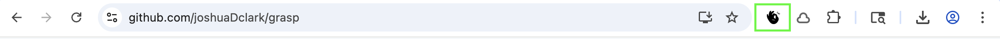
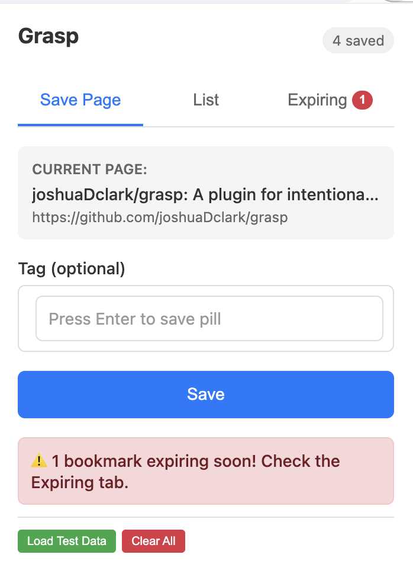
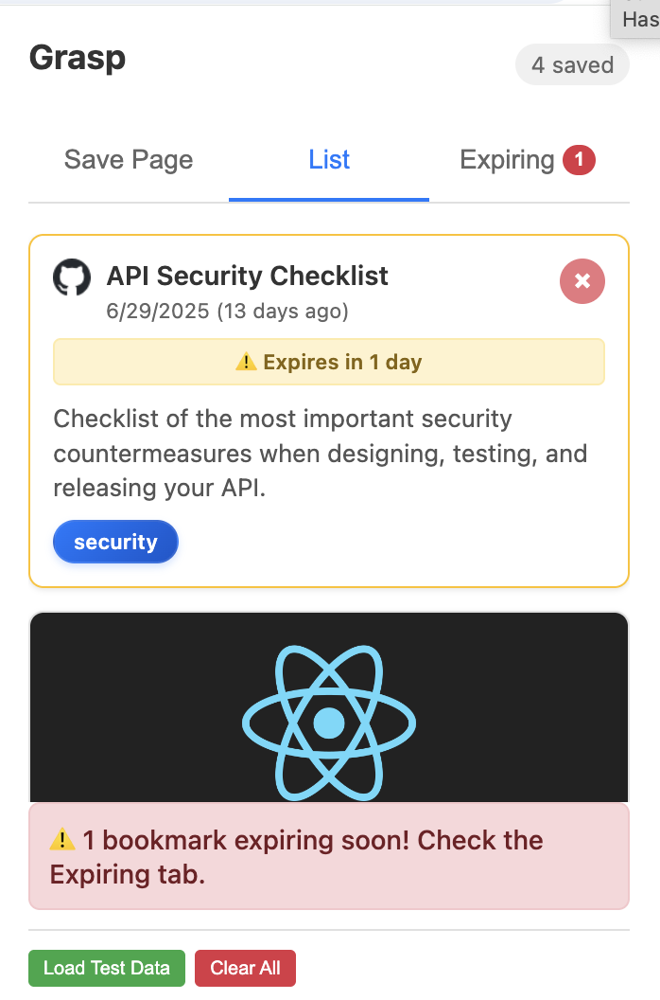
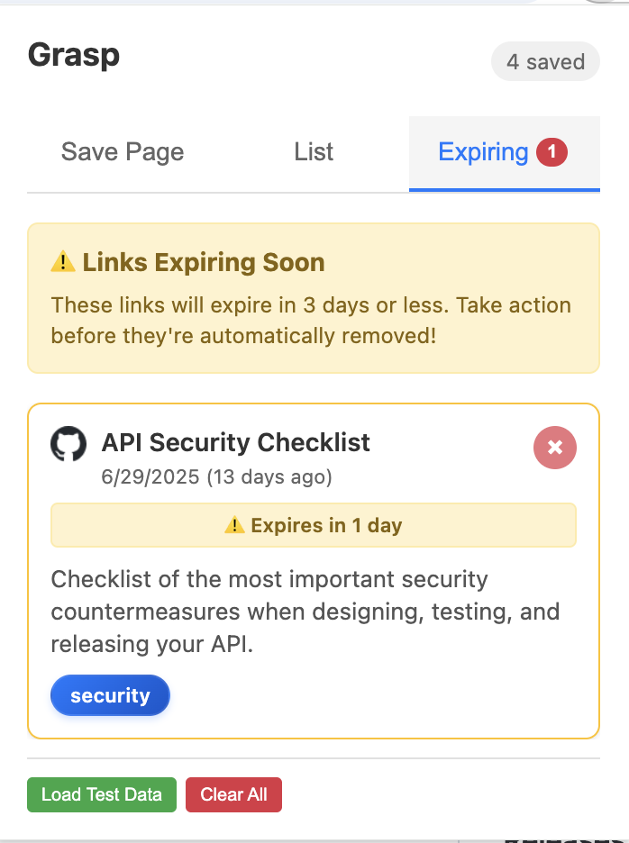

# Grasp - Chrome Extension

**Grasp** is a minimal Chrome extension that helps you save links intentionally — not just collect digital clutter.

With one click, Grasp captures the current tab’s title and URL and stores it locally. Every link you save has a **14-day shelf life**. You’ll get a gentle reminder **3 days before it expires**, encouraging you to read, act, or let it go.

Grasp isn’t about hoarding. It’s about giving you a chance to follow through — and then move on.


## Features

- **Quick Save**: Capture current tab with enhanced metadata (images, descriptions, author info)
- **Smart Tags**: Modern pill-style tagging with real-time creation and deletion
- **Link Expiration**: 14-day automatic expiration with 3-day warning system
- **Rich Previews**: Hover preview cards showing full page metadata
- **Three-Tab Interface**: Save, List (all bookmarks), and Expiring (urgent items)
- **Auto Cleanup**: Expired links are automatically removed

## Installation

1. [Download](https://github.com/joshuaDclark/grasp/archive/refs/tags/1.0.0.zip) the zip package of this repository.
2. Open Chrome and navigate to `chrome://extensions/`
3. Enable "Developer mode" (top right toggle)
4. Click "Load unpacked" and select the extension directory
5. The Grasp icon will appear in your browser toolbar



## Usage

### Saving Pages
1. Click the Grasp extension icon
2. Add tags using the pill interface (space/comma creates pills)
3. Click Save or press Ctrl/Cmd+Enter



### Managing Bookmarks
- **List Tab**: View all saved bookmarks (expiring shown first)
- **Expiring Tab**: Focus on links expiring within 3 days
- **Hover Previews**: Hover over bookmark titles for rich previews
- **Delete**: Click the × button on any bookmark card





## Technical Details

- **Manifest Version**: 3
- **Permissions**: activeTab, storage, scripting
- **Storage**: chrome.storage.local
- **No Build Process**: Vanilla JavaScript, no dependencies

## File Structure

```
grasp/
├── manifest.json      # Extension configuration
├── popup.html         # Main UI structure
├── popup.js          # Core functionality
└── styles.css        # Complete styling
```